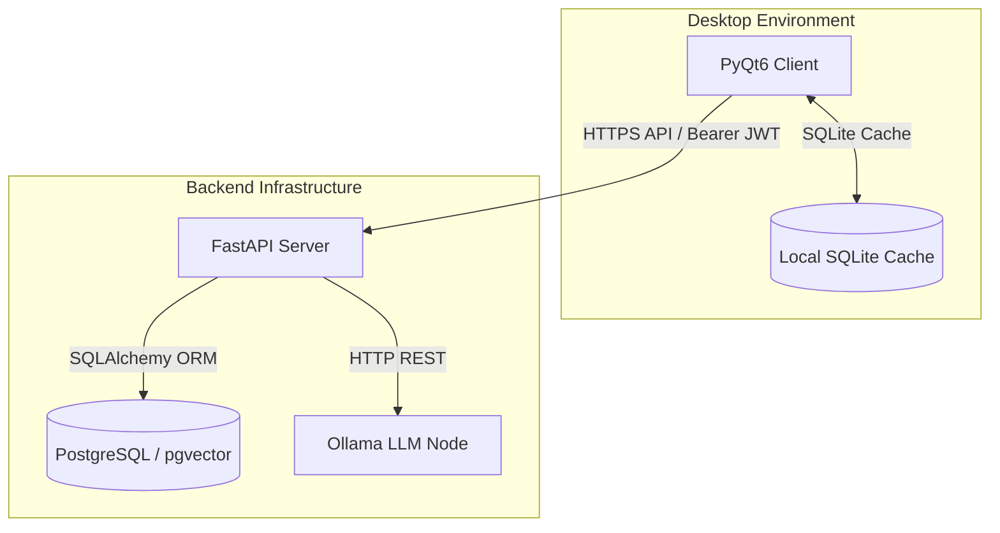

# AI-Career Bridge Backend

The FastAPI backend for the **AI-Career Bridge** desktop application. It manages secure user authentication, synchronizes state between local client storage and a centralized database, and handles structured academic study plan generation using local Large Language Models (LLMs) via Ollama.

---

## 1. Overview

The AI-Career Bridge Backend serves as the central server for the desktop PyQt6 client. It coordinates three core responsibilities:
- **Authentication & Identity**: User account registration and secure JWT-based session verification.
- **State Synchronization**: Dual-engine sync (pulling and pushing) that hydrates local SQLite storage from central PostgreSQL database state.
- **AI Academic Planning**: Generating comprehensive weekly study schedules, roadmap milestones, and career readiness scores by orchestration with Ollama.

The backend is built around a local-first paradigm. It allows the PyQt6 desktop app to operate offline using its local SQLite cache, recover state seamlessly upon connection restoration, and sync data without risking the loss of richer server-side academic profile inputs.

---

## 2. Architecture



### Architectural Notes
- **Client Cache**: SQLite resides exclusively on the client machine to enable offline interactivity.
- **Centralized DB**: PostgreSQL handles the system of record. It persists student profiles and their accompanying structural academic contexts.
- **Inference Node**: Ollama runs on a dedicated network node (configured via OLLAMA_BASE_URL) hosting the model, insulating backend CPU performance from intensive LLM generation loads.

---

## 3. Features

- **Secure Authentication**: Password hashing using bcrypt and stateless session validation via HS256 JSON Web Tokens (JWT).
- **Protected Routing**: Explicit route validation using the FastAPI HTTPBearer security dependency.
- **PostgreSQL Context Persistence**: Structured student_context table mapping each student UUID to their full JSON academic data profile (raw_input).
- **Bidirectional Synchronization**:
  - POST /api/v1/sync: Client pushes offline updates to the server. Includes intelligent context-aware checks to prevent fresh, unconfigured clients from overwriting populated server-side raw input data.
  - GET /api/v1/sync/context: Authenticated pull endpoint. Automatically initializes an empty, default context on the database for fresh registrants.
- **AI Planning Pipeline**:
  - POST /api/v1/ai/generate_academic_plan: Dispatches in-process BackgroundTask to fetch plans from the LLM, leaving the HTTP thread open for fast client response.
  - GET /api/v1/ai/academic_plan_status: Allows clients to poll status (EMPTY, PENDING, COMPLETED, FAILED).
- **JSON Repair & Validation Pipeline**: Parses raw output, isolates JSON structures from stray reasoning tags (like think), normalizes task types and priority mappings using alias dictionaries, and strictly validates the schema via Pydantic before saving.
- **Dockerized Deployment**: Fully containerized FastAPI server and PostgreSQL setup.

---

## 4. Tech Stack

- **Core**: Python 3.12, FastAPI, Uvicorn (ASGI server)
- **Database & ORM**: PostgreSQL (using pgvector/pgvector:pg16 image), SQLAlchemy 2.0
- **Security & Cryptography**: PyJWT (HS256 signature verification), bcrypt (password hashing)
- **Validation**: Pydantic v2
- **Network**: HTTPX (async client for Ollama API communication)
- **Orchestration**: Docker, Docker Compose

---

## 5. Repository Structure

```
.
├── Dockerfile                   # Build configuration for the FastAPI container
├── docker-compose.yaml          # Multi-container orchestration (FastAPI + PostgreSQL)
├── requirements.txt             # Project Python dependencies
├── .env.example                 # Environment variables template
├── backend/                     # Application source root
│   ├── main.py                  # Server entrypoint and router mounts
│   ├── core/                    # System cores
│   │   ├── database.py          # SQLAlchemy engine and session configurations
│   │   ├── security.py          # Hashing, token generation, and decoding
│   │   ├── auth_deps.py         # HTTPBearer auth dependency
│   │   └── schemas.py           # Pydantic validation structures
│   ├── models/                  # Database layer
│   │   └── models.py            # Student and StudentContext SQL schemas
│   ├── routers/                 # API controllers
│   │   ├── auth.py              # Register, login, and user profile
│   │   ├── sync.py              # Pull/Push state synchronization
│   │   └── ai.py                # Academic plan triggers and status checking
│   └── services/                # Business logic
│       └── ai_engine.py         # Prompt building, Ollama REST API client, and JSON repair
```

---

## 6. Environment Variables

Configure application settings by creating a .env file in the project root directory. Use .env.example as a template:

| Variable | Description | Example Value |
|---|---|---|
| POSTGRES_USER | PostgreSQL superuser username | vor |
| POSTGRES_PASSWORD | PostgreSQL superuser password | your_secure_password |
| POSTGRES_DB | Target PostgreSQL database name | aicareer_bridge |
| DATABASE_URL | SQLAlchemy connection string | postgresql://vor:password@db:5432/aicareer_bridge |
| JWT_SECRET_KEY | Cryptographic secret for signing JWTs | a_long_random_hex_string_for_security |
| OLLAMA_BASE_URL | Connection URL for the Ollama inference node | http://100.80.253.23:11434 |
| OLLAMA_MODEL | Target language model to pull and query | maternion/lfm2.5 |
| OLLAMA_TIMEOUT_SECONDS | Connection and generation read timeout | 300 |

> [!WARNING]
> The .env file contains sensitive security credentials and must never be committed to version control. The .gitignore of the repository is configured to exclude it. Real production secrets must be rotated immediately if exposed.

---

## 7. Running with Docker

Deploy the complete database and backend stack locally using Docker Compose:

### 1. Build and Start Services
```bash
docker compose up --build -d
```
*Starts PostgreSQL on port 5432 and the FastAPI server on port 8000.*

### 2. Verify Container Health
```bash
docker compose ps
```

### 3. Stream Application Logs
```bash
docker logs -f aicareer-backend
```

### 4. Health Check Endpoint
Query the server directly to verify database connections and routers are active:
```bash
curl http://localhost:8000/health
```
Response:
```json
{"status": "online", "service": "ai-academic-planner-backend"}
```

---

## 8. API Endpoint Summary

All routes under /api/v1/sync and /api/v1/ai require authentication. Clients must pass the received JWT token in the request headers: Authorization: Bearer <JWT_TOKEN>.

| Method | Path | Auth | Purpose |
|---|---|---|---|
| GET | /health | No | Heartbeat status check | | POST | /api/v1/auth/register | No | Sign up new user. Returns JWT and basic profile. |
| POST | /api/v1/auth/login | No | Verify credentials. Returns JWT. |
| GET | /api/v1/auth/me | Yes | Returns authenticated student profile. |
| POST | /api/v1/sync | Yes | Bidirectional push for profiles and raw academic data. |
| GET | /api/v1/sync/context | Yes | Pulls student profile and context. Initializes defaults if empty. |
| POST | /api/v1/ai/generate_academic_plan | Yes | Triggers asynchronous plan generation job. |
| GET | /api/v1/ai/academic_plan_status | Yes | Retrieves status and the plan if completed. |

---

## 9. AI Generation Flow

1. **Context Alignment**: The client pushes the local academic profile of the student (timetable, major, GPA, current courses, skills) using POST /api/v1/sync.
2. **Dispatch**: The client requests plan generation via POST /api/v1/ai/generate_academic_plan. 
3. **Queue and Respond**: The backend sets ai_status to PENDING, records the timestamp, and spawns an asynchronous BackgroundTask to query Ollama. It immediately returns HTTP 200 to the client.
4. **Execution**: The background worker builds a structured system prompt using /no_think formatting instructions and calls the model.
5. **JSON Parsing and Repair**:
   - Isolates the JSON object by finding the first { and last } (removing think or reasoning tags).
   - Validates structure. If keys contain common LLM aliases (e.g. ongoing instead of in_progress), the engine repairs them using pre-defined normalizers.
6. **Persistence**:
   - **On Success**: Saves the schema-compliant JSON to ai_plan and updates ai_status to COMPLETED.
   - **On Failure**: Records the error message in ai_last_error, populates a safe empty schema layout, and sets ai_status to FAILED.
7. **Polling**: The client queries GET /api/v1/ai/academic_plan_status at intervals to retrieve the generated schedule.

---

## 10. Development and MVP Notes

This repository represents an MVP demonstration of the local-first academic planner system. Developers should note the following constraints:
- **Database Migrations**: Database schemas are initialized dynamically on startup using SQLAlchemy create_all(). There is no versioned migration framework (like Alembic). Avoid schema alterations without manually dropping tables or running script updates.
- **Job Reliability**: Asynchronous tasks use FastAPI in-process memory BackgroundTasks. If the Docker container crashes or restarts during execution, jobs will be lost and stuck in PENDING. They do not use a durable queue (like Celery/Redis). Stale pending tasks (greater than 10 minutes) are automatically detected and rescheduled upon subsequent generation requests.
- **pgvector Integration**: The database utilizes the pgvector/pgvector:pg16 image for future-proofing vector search capabilities. However, RAG and vector databases are not currently used in the core academic plan pipeline.
- **Security Protocols**: Production deployments will require setting up an HTTPS reverse proxy (like Nginx or Caddy) to secure auth headers. Token revocation, refresh tokens, and API rate-limiting are not yet implemented.

---

## 11. Verification Checks

Run the following smoke tests during local development:

### 1. Syntactic Verification
Check routing and schemas compile cleanly:
```bash
python -m py_compile backend/routers/sync.py backend/core/schemas.py
```

### 2. Boot Check
Confirm the backend container starts and resolves module imports correctly:
```bash
docker compose up --build -d backend
```

### 3. Auth and Generation Verification
Perform a complete login, sync, and status-check flow to ensure API components interact correctly:
- Register a user account and save the JWT.
- Push a sample student context body to /api/v1/sync.
- Trigger generation on /api/v1/ai/generate_academic_plan.
- Poll status on /api/v1/ai/academic_plan_status to ensure it transitions to COMPLETED.

---

## 12. Related Documentation

- backend_documentation_v2.md: Full architectural context, design tradeoffs, security decisions, and academic defenses.
you can read the doc here: https://drive.google.com/file/d/1BNNQLJ7eXhlQAdz26SgVUoTeh_pU6S5Y/view?usp=sharing
- Project reports and visual mockup assets are stored within the main repository directory.
